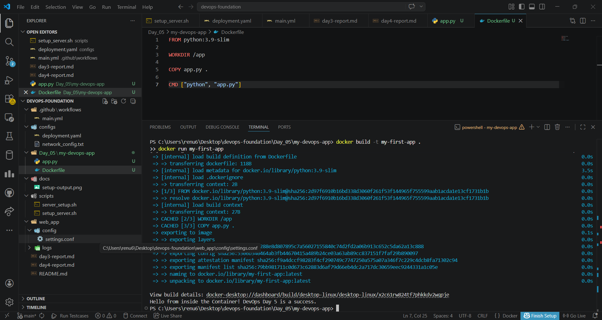
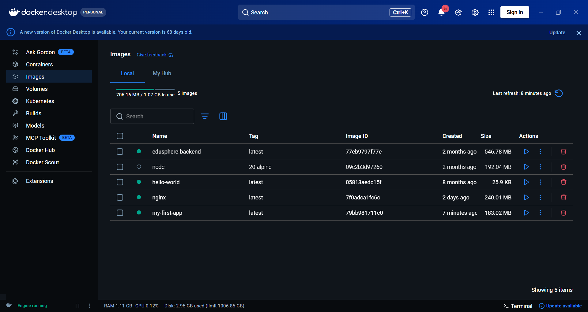
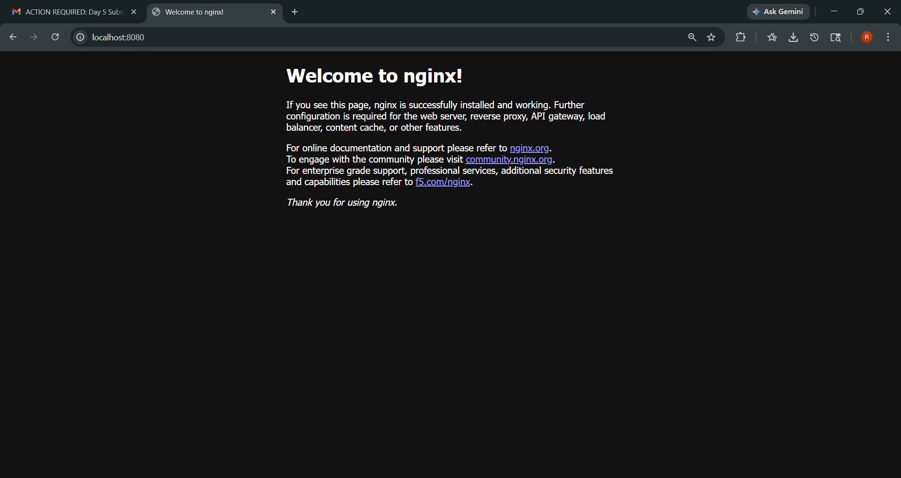

## Day 5: The Container Revolution

### What is a Container?
A container is a lightweight package that includes an application and its dependencies, ensuring it runs consistently across environments.

### Key Concepts
- Dockerfile → Instructions to build image  
- Image → Packaged application  
- Container → Running instance  

### Port Mapping (Reflection)
We used the command:
docker run -d -p 8080:80 nginx

This maps host port 8080 to container port 80. It allows us to access the nginx web server running inside the container from our browser.

### Learning
Containers are ephemeral, meaning they can be created, stopped, and deleted easily without affecting the system.

## Output Screenshots

### 🔸 Docker Build & Run Output


### 🔸 Docker Images Output


### 🔸 Nginx Browser Output


### Dockerfile Used

```dockerfile
FROM python:3.9-slim

WORKDIR /app

COPY app.py .

CMD ["python", "app.py"]