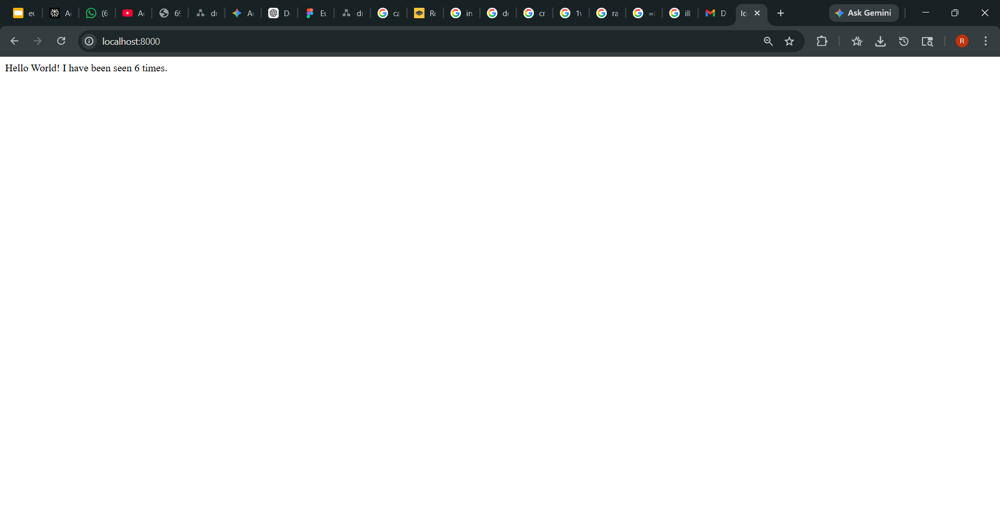
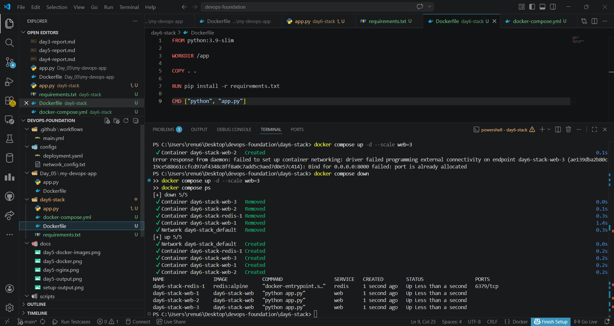

# Day 6: Orchestration Basics

## Objective
To build and manage a multi-container application using Docker Compose where a web app communicates with a Redis database.

---

## What I Built
- Flask Web Application (Hit Counter)
- Redis Database
- Managed both using Docker Compose

---

## Commands Used
docker compose up -d  
docker compose ps  
docker compose logs -f web  
docker compose down  
docker compose up -d --scale web=3  

---

## Output
The application runs on:
http://localhost:8000  

It displays:
"Hello World! I have been seen X times."  

The count increases on every refresh.

---

## Screenshots
  
  

---

## Scaling Experiment
I scaled the web service using:
docker compose up -d --scale web=3  

### Observation
Multiple web containers were created and all were connected to the same Redis database. The hit counter increased consistently across all instances.

---

## Reflection
It is useful to define Redis in the same docker-compose file as the web application because both services run in a shared network and environment. This allows easy communication using service names without manual configuration.

Using a single compose file ensures consistency, simplifies deployment, and allows both services to be managed together. It reduces errors, improves scalability, and makes the system reproducible.

---

## Learning
Docker Compose simplifies multi-container application management and makes deployment, scaling, and communication between services efficient.